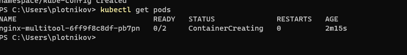
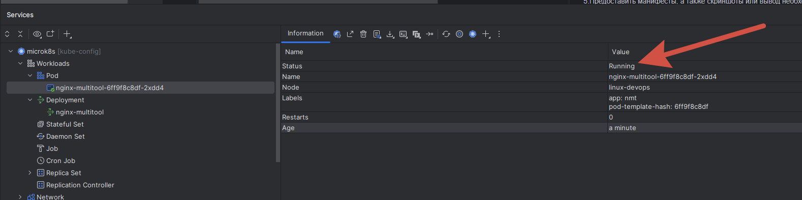
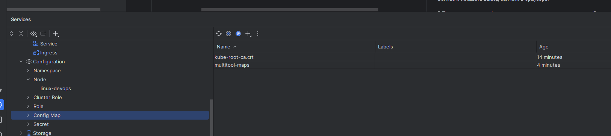
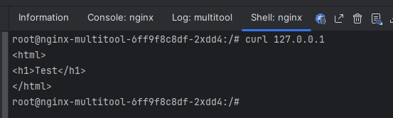
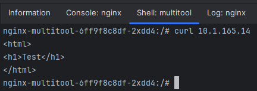
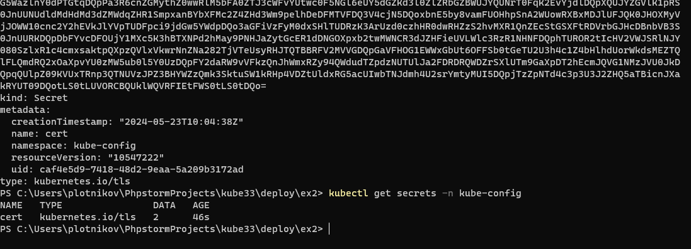
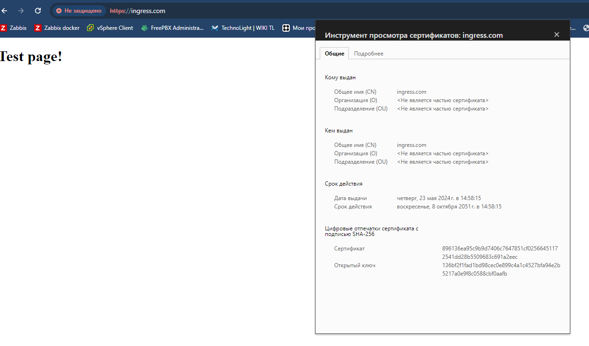

## Задание 1. Создать Deployment приложения и решить возникшую проблему с помощью ConfigMap. Добавить веб-страницу

1.Создать Deployment приложения, состоящего из контейнеров nginx и multitool.
>[deployment.yaml](deploy%2Fdeployment.yaml)

2.Решить возникшую проблему с помощью ConfigMap.

>Не запускается один контейнер пода, по той причине, что оба используют 80 порт, смещаю один порт у контейнера через ConfigMap.\
[confmap.yaml](deploy%2Fconfmap.yaml)
> 
3.Продемонстрировать, что pod стартовал и оба конейнера работают.
Нашел удобный модуль для продуктов JB, тут можно кнопочками деплоить поды и тд, видно что под успешно запустился, так же видно мой конфиг мап.
>

4.Сделать простую веб-страницу и подключить её к Nginx с помощью ConfigMap. Подключить Service и показать вывод curl или в браузере.
>Все еще довольный тестирую возможности дополнения JB, можно кнопочками быстро заходить в контейнеры пода, смотреть дескрайб, получать IP, очень ускоряет работу.

> 
5.Предоставить манифесты, а также скриншоты или вывод необходимых команд.
>[confmap.yaml](deploy%2Fconfmap.yaml)\
>[deployment.yaml](deploy%2Fdeployment.yaml)

## Задание 2. Создать приложение с вашей веб-страницей, доступной по HTTPS

1.Создать Deployment приложения, состоящего из Nginx.
>[deployment.yaml](deploy%2Fex2%2Fdeployment.yaml)

2.Создать собственную веб-страницу и подключить её как ConfigMap к приложению.
>[confmap.yaml](deploy%2Fex2%2Fconfmap.yaml)

3.Выпустить самоподписной сертификат SSL. Создать Secret для использования сертификата.

4.Создать Ingress и необходимый Service, подключить к нему SSL в вид. Продемонстировать доступ к приложению по HTTPS.
>[nginx_ingress.yaml](deploy%2Fex2%2Fnginx_ingress.yaml)\
> [nginx_service.yaml](deploy%2Fex2%2Fnginx_service.yaml)\
> [nginx_secret.yaml](deploy%2Fex2%2Fnginx_secret.yaml)
>

5.Предоставить манифесты, а также скриншоты или вывод необходимых команд.
> [deployment.yaml](deploy%2Fex2%2Fdeployment.yaml)\
[nginx_ingress.yaml](deploy%2Fex2%2Fnginx_ingress.yaml)\
[nginx_maps.yaml](deploy%2Fex2%2Fnginx_maps.yaml)\
[nginx_secret.yaml](deploy%2Fex2%2Fnginx_secret.yaml)\
[nginx_service.yaml](deploy%2Fex2%2Fnginx_service.yaml)